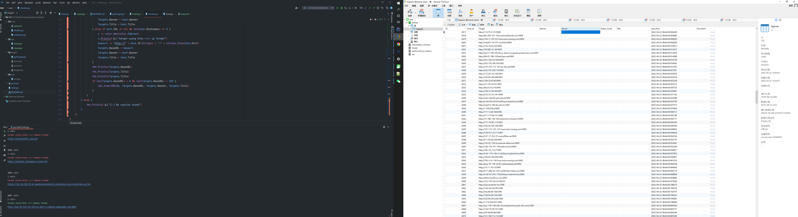

# fcs
调用网络空间搜索引擎获取目标BaseUrl并写入数据库，最终输出到POC扫描模块

## API 调用信息搜集模块

- [x] Shodan API
- [x] Fofa API
- [ ] Zoomeeye API 
- [x] 数据清洗去重

## 使用方法

在query目录下，有shodan.txt，fofa.txt，zoomeye.txt。根据目标规则，写入规则即可

2022.5.7
